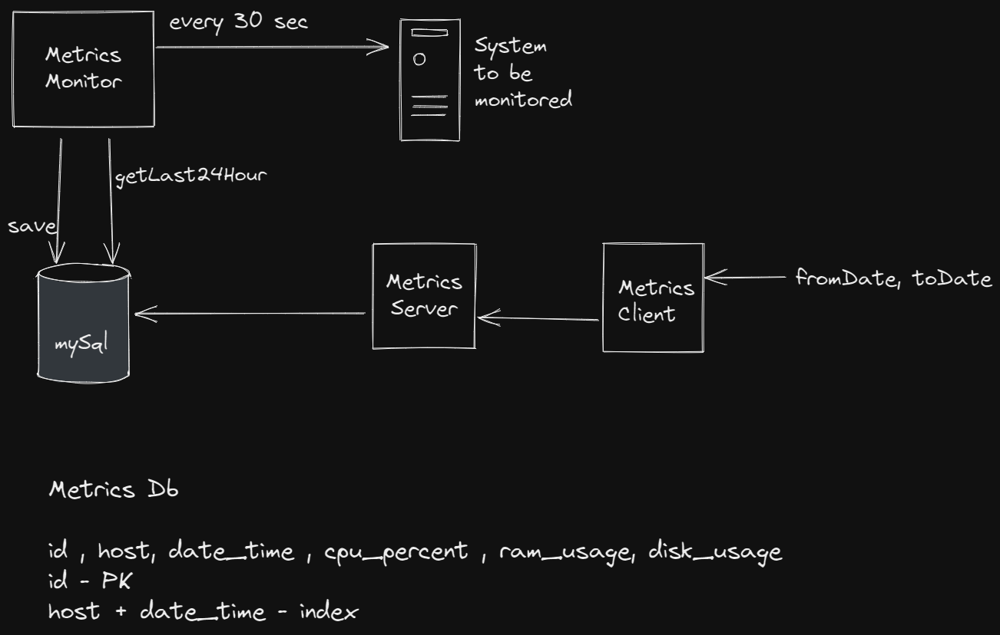

Operating system resource monitoring application.

Used the following -

MetricsWorker - Worker thread that collects metrics and prints 24 hr metrics

Database - MySql

Client-Server model - Metrics Server and Metrics Client

### Prerequisite
- Jdk 8
- Maven
- docker installed on your machine

### Instructions to run the program

1. Open this project in your favorite editor and run `mvn clean install`

2. On a separate console go to path `/monitor/src/main/resources`

3. Execute `docker-compose up`

4. Run main method in `MetricsMonitorMain.java`

5. Run main method in `MetricsServer.java`

6. Run main method in `MetricsClient.java`

7. Enter the input in format `dd MM yyyy HH mm ss` for fromDate and toDate

